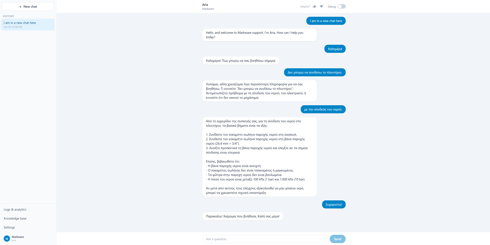
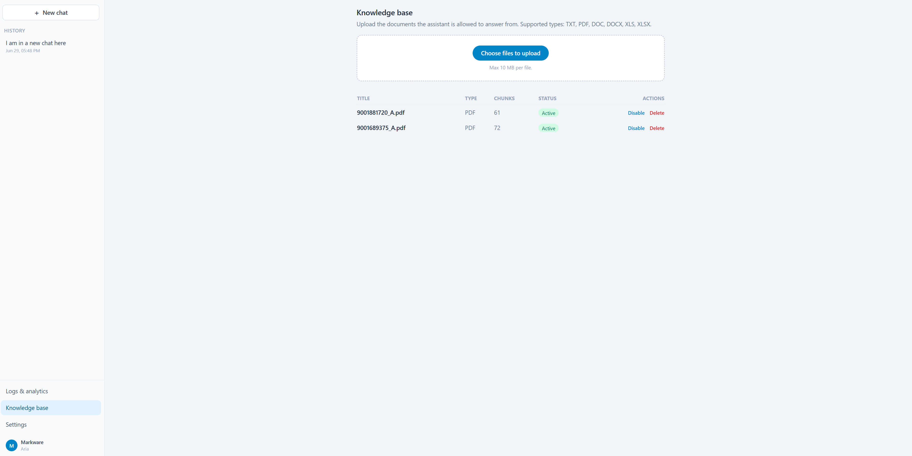
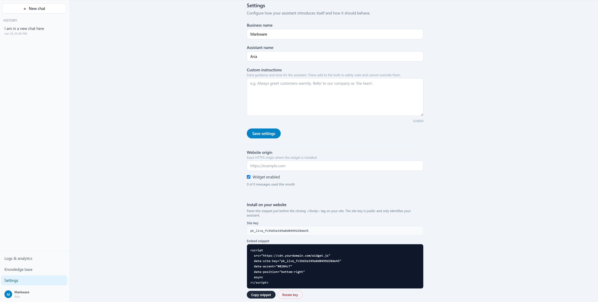
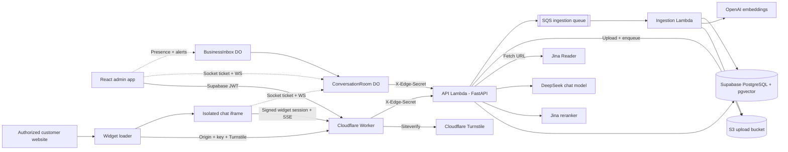

# Plug & Play

Plug & Play is a customer support assistant that answers from a company's own
documents and can be embedded on an authorized website with a script tag.

The application combines a React administration workspace, multilingual streaming
chat, asynchronous document and web-page ingestion, reranked retrieval-augmented
generation, live human handoff over WebSockets, an isolated iframe widget with
Cloudflare Turnstile bot protection, a static marketing site, and a two-Lambda
serverless deployment fronted by a Cloudflare Worker.

One authenticated owner can run **multiple websites** from a single workspace. Each
website has its own assistant, knowledge base, conversations, analytics, widget
installation, and monthly usage, fully isolated from the others.

## Product

### Multilingual, grounded support

The assistant retrieves relevant passages from the site's knowledge base and streams
a contextual response. Follow-up questions are rewritten into standalone retrieval
queries so context carries across a conversation. Conversations are retained for
review, ratings, and analytics.



### Document and link knowledge base

Administrators can upload PDF, DOC, DOCX, TXT, XLS, and XLSX files, or add a web page
by URL, then watch each source move through its processing states (queued,
processing, ready, or failed) as a background Lambda extracts, chunks, and embeds it.
Pages are fetched and cleaned by Jina Reader and ingested through the same pipeline as
files. Admins can inspect the number of generated chunks, temporarily disable
sources, and remove outdated material.



### Multiple websites, one workspace

Each website is created with its own name, assistant, and authorized widget origin,
and is switched between from the sidebar. Per-site settings control the exact
authorized origin, installation status, public key rotation, custom assistant
behavior, monthly usage, and whether live human handoff is available.



### Live human handoff

When a visitor needs a person, the conversation can hand off from the AI to the site
owner in real time - the AI stops answering and the owner takes over the same thread:

- The widget reveals a **Need more help? / Talk to a person** action after the visitor
  has sent a few messages; the threshold survives a refresh and resets on a new
  conversation.
- The owner sees a live badge and hears a sound in the dashboard, toggles an
  **Online / Offline** presence, and accepts a waiting conversation to take over.
- If no owner is online (or none accepts within the timeout), the visitor is offered a
  **callback form**; requests land in a dashboard callback queue the owner can resolve.
- Handoff, messages, and closure flow over WebSockets held at the edge, while the
  backend remains the single authority for who is assigned and what was said.

The feature is dark-launched behind deployment flags and a per-site toggle, so it is
invisible until explicitly enabled.

## Highlights

- **Hybrid, reranked retrieval-augmented generation:** OpenAI `text-embedding-3-large`
  embeddings (1536 dims) and PostgreSQL full-text search, fused with Reciprocal Rank
  Fusion over pgvector cosine (HNSW) and lexical results, a Jina cross-encoder reranker
  over a wide candidate set, and follow-up query contextualization for standalone
  retrieval.
- **Multilingual streaming chat:** DeepSeek V4-Flash (OpenAI-compatible API, thinking
  off) streams grounded answers over SSE.
- **Asynchronous ingestion pipeline:** file uploads and fetched web pages are stored in
  S3 and queued to a dedicated ingestion Lambda that extracts, normalizes, filters junk
  fragments, chunks with overlap, and embeds - off the request path, with a dead-letter
  queue for failures and re-ingestion without re-uploading.
- **Live human handoff:** an AI→human escalation state machine with atomic single-winner
  acceptance, accept timeouts, and a callback fallback, carried over Cloudflare Durable
  Objects using WebSocket Hibernation while PostgreSQL stays the source of truth.
- **Multi-site workspace:** one owner manages many websites, each an isolated tenant
  with its own assistant, documents, conversations, analytics, and widget.
- **Embeddable widget:** a small dependency-free loader, Shadow DOM launcher, and
  isolated iframe chat application.
- **Bot protection:** Cloudflare Turnstile guards the widget session bootstrap. The
  edge Worker verifies the token (checking hostname and action) before the backend
  will issue a session, and the backend trusts only the Worker's attestation header -
  never the raw token.
- **Public endpoint protection:** exact-origin widget bootstrap, short-lived signed
  sessions, key rotation, installation disablement, message-size validation, and
  atomic monthly quotas.
- **Edge controls:** Cloudflare rate limits public chat by client IP and installation,
  throttles widget-session and live-connection attempts, and a shared edge secret
  blocks direct access to the Lambda origin.
- **Operational visibility:** conversation history, live/waiting queue, customer
  ratings, unanswered question reporting, and retrieved-source debugging.

## Architecture



### Request security

1. The widget loader runs on the customer website and exchanges its public key, plus
   a Cloudflare Turnstile token, from the configured browser origin.
2. The edge Worker verifies the Turnstile token with Siteverify (matching the expected
   hostname and action) and, on success, injects an internal attestation header. The
   backend trusts only that header - never the raw token - when Turnstile enforcement
   is enabled.
3. The backend compares that exact origin with the site's active installation and
   returns a short-lived signed widget session.
4. The iframe uses the signed session for chat; it never uses a profile ID or public
   key as authorization.
5. Conversation IDs are accepted only when they belong to the session's site.
   Missing, stale, or foreign IDs start a new conversation.
6. PostgreSQL atomically enforces the monthly installation quota before model work.

### Retrieval-augmented generation

Retrieval runs up front on every turn (RAG-always) and the answer streams in a single
model call:

1. A follow-up message is rewritten into a standalone retrieval query using bounded
   recent history; the literal message is searched too, and any rewrite failure falls
   back to it.
2. Each query variant runs both semantic search (pgvector cosine over the HNSW index,
   dropping results below the relevance threshold) and lexical full-text search. The
   ranked lists are fused with Reciprocal Rank Fusion into one candidate set.
3. A Jina cross-encoder reranks the fused candidates against the standalone question
   and keeps the best `RAG_TOP_K`. Reranking and contextualization are best-effort -
   without a key, or on any error or timeout, fusion order (and the literal query) is
   used, so a search never blocks an answer.
4. The top chunks are injected as a system message and DeepSeek V4-Flash streams the
   grounded answer over SSE, emitting structured `conversation`/`sources`/`token`/
   `done` events.

### Live human escalation

When live support is enabled, the FastAPI Lambda remains the authorization and
persistence authority; PostgreSQL owns conversation mode, assignment, messages,
idempotency, audit events, and callback tickets. Cloudflare holds the idle WebSockets
across two Durable Objects using WebSocket Hibernation:

- **`ConversationRoom`** (keyed by conversation ID) joins the visitor and the owner and
  brokers escalate / accept / message / cancel / close, plus a SQLite alarm that commits
  the accept timeout.
- **`BusinessInbox`** (keyed by site/profile ID) tracks manual owner presence and pushes
  waiting alerts and transitions to the dashboard.

The ordering rule is **authorize → persist → acknowledge → broadcast**. The browser
never sees the edge secret: Lambda mints a 60-second signed socket ticket that the
Worker redeems through `/internal/live/authorize`, validating that its scope matches
the requested Durable Object before forwarding trusted claims. Visitor access also
requires a conversation-scoped token whose random session identifier is stored only as
a SHA-256 hash.

Acceptance uses a conditional `UPDATE ... RETURNING`, so exactly one operator can win.
The AI service checks `mode == ai` before doing work and again before saving output,
and the widget aborts the active SSE request on escalation. State transitions:

```text
ai -> waiting -> human -> closed
         |
         +-> pending_ticket -> closed     (offline / accept timeout)
         +---- visitor cancel ----------------------> ai
```

See [docs/LIVE_HUMAN_ESCALATION.md](docs/LIVE_HUMAN_ESCALATION.md) for the full design
and [docs/LIVE_HUMAN_ESCALATION_RUNBOOK.md](docs/LIVE_HUMAN_ESCALATION_RUNBOOK.md) for
the staged deployment checklist.

### Asynchronous ingestion

Ingestion runs off the request path across the two Lambdas:

1. An admin upload is validated (type and 10 MB limit) or a URL is fetched and cleaned
   by Jina Reader, stored encrypted in the S3 upload bucket, recorded as a `queued`
   source, and enqueued to SQS. The API responds `202 Accepted` immediately.
2. The SQS-triggered ingestion Lambda downloads the object, marks it `processing`, then
   extracts, chunks, and embeds it (the `.doc` path uses the `antiword` binary baked
   into the ingestion image; fetched pages reuse the text extractor).
3. On success the source flips to `ready` and its S3 object is deleted; on an
   unsupported file or extraction error it is marked `failed`. Transient errors retry
   up to three times before the message lands in the dead-letter queue.

## Technology

| Area           | Stack                                                             |
| -------------- | ----------------------------------------------------------------- |
| Frontend       | React 18, TypeScript, Vite, Tailwind CSS, SWR, React Router       |
| Marketing site | Astro static SSG, Tailwind CSS, JSON-LD schema, per-page SEO      |
| Widget         | TypeScript, Shadow DOM, iframe isolation, Server-Sent Events      |
| Backend        | FastAPI, SQLAlchemy 2.0 async, Pydantic, Alembic                  |
| Ingestion      | SQS-triggered Lambda, S3, antiword, Jina Reader (URL fetch)       |
| Retrieval      | OpenAI embeddings, PostgreSQL, pgvector HNSW, Jina reranker       |
| Generation     | DeepSeek V4-Flash (OpenAI-compatible streaming API)               |
| Live support   | Cloudflare Durable Objects, WebSocket Hibernation, callback queue |
| Bot protection | Cloudflare Turnstile (edge Siteverify + backend attestation)      |
| Authentication | Supabase Auth with JWT validation                                 |
| Production     | Two AWS Lambdas, ECR, S3, SQS, Cloudflare Worker/Pages, Supabase  |
| Testing        | pytest, Vitest, Testing Library, TypeScript production builds     |

## Run Locally

### Requirements

- Docker
- Node.js 18+
- A DeepSeek API key
- An OpenAI API key
- A Jina API key (optional - enables reranking and URL ingestion)

### Backend

```bash
cd backend
cp .env.example .env
```

Set at least:

```env
DEEPSEEK_API_KEY=your-deepseek-key
OPENAI_API_KEY=your-openai-key
WIDGET_SESSION_SECRET=generate-a-long-random-secret
```

Optionally set `JINA_API_KEY` to enable retrieval reranking and web-page ingestion;
without it, retrieval falls back to cosine order and URL ingestion is unavailable.

Start PostgreSQL and the API, then apply the schema:

```bash
docker compose up -d --build
docker compose run --rm backend alembic upgrade head
```

The API is available at `http://localhost:8000`; `GET /health` is the health check.
Authentication is optional in local development and required when the Supabase JWT
secret is configured.

Document ingestion runs on AWS: uploads are stored in S3 and processed by a separate
SQS-triggered Lambda. To exercise uploads locally, set `INGESTION_BUCKET`,
`INGESTION_QUEUE_URL`, and `AWS_REGION` (pointing at real or emulated S3/SQS) and run
the ingestion handler against the queue; without them the upload endpoint returns
`503`.

Live human escalation is off unless `LIVE_HUMAN_ESCALATION_ENABLED=true`, the Worker
flag is set, and a site enables it - the real-time WebSocket transport requires the
deployed Cloudflare Durable Objects.

### Frontend

```bash
cd frontend
cp .env.example .env
npm install
npm run dev
```

Open `http://localhost:5173`, create your first website, upload documents or add a URL
under **Knowledge base**, then start a conversation. To test the embedded widget,
configure the site's exact website origin under **Settings** and use the generated
snippet.

### Marketing site

The public landing and legal pages are a separate static Astro project in `site/`:

```bash
cd site
npm install
npm run dev
```

Open `http://localhost:4321`. See [site/README.md](site/README.md) for details.

## Widget Build

```bash
cd frontend
npm run build:widget
```

The build creates:

```text
frontend/dist-widget/
|-- widget.js
`-- app/
    |-- index.html
    `-- assets/
```

Host that directory on a stable HTTPS origin and set `VITE_WIDGET_SRC` when building
the admin frontend so its generated installation snippet points to the deployed
loader.

## Tests

```bash
cd backend
pytest

cd ../frontend
npm test
npm run build
npm run build:widget

cd ../deploy/cloudflare/worker
npm ci
npm run check
npm test
```

The backend suite covers authentication rejection, edge-secret enforcement, Turnstile
attestation on the widget bootstrap, per-site isolation, foreign conversation IDs,
message limits, signed widget sessions, live socket-ticket authorization and the live
escalation repository, chat guardrails, asynchronous ingestion queueing and status
transitions, secret redaction, and the absence of retired voice endpoints. Frontend
tests cover authentication, the site switcher, the application shell, and the live
conversation UI. The Cloudflare Worker has its own type-check and Vitest suite for edge
auth, rate limiting, and Durable Object routing.

## Maintenance Scripts

- `backend/reingest_documents.py` rebuilds chunks and embeddings from each stored
  document after chunking, filtering, or embedding changes.
- `backend/reindex_embeddings.py` regenerates vectors for existing chunks without
  changing chunk boundaries.

## Deployment Notes

The production design uses Cloudflare Pages for the admin application and widget
assets, a Cloudflare Worker for edge authentication, Turnstile verification, rate
limiting, and the live-support Durable Objects, and Supabase for authentication and
pgvector data. The backend runs as two AWS Lambda container images built from separate
Dockerfiles:

- **API Lambda** (`Dockerfile.lambda`, `requirements-api.txt`) - FastAPI behind the
  Lambda Web Adapter with response streaming for SSE. Deployed by
  `deploy/aws/deploy-backend.sh`; migrations are applied separately with
  `deploy/aws/migrate-backend.sh` (Alembic run from the same image).
- **Ingestion Lambda** (`Dockerfile.ingestion.lambda`, `requirements-ingestion.txt`) -
  the SQS-triggered document processor, with `antiword` for legacy `.doc` files.
  Deployed by `deploy/aws/deploy-ingestion.sh`.

Production requires separate random values for `EDGE_SHARED_SECRET` and
`WIDGET_SESSION_SECRET`. The widget CDN must be present in `WIDGET_ALLOWED_ORIGINS`;
customer websites are authorized individually through each installation's exact origin
rather than a global wildcard. The API Lambda also needs `INGESTION_BUCKET` and
`INGESTION_QUEUE_URL` to accept uploads.

Turnstile enforcement is opt-in and staged: deploy the validating Worker first
(`TURNSTILE_SECRET_KEY`, `TURNSTILE_EXPECTED_HOSTNAME`, `TURNSTILE_EXPECTED_ACTION`),
then set `TURNSTILE_REQUIRED=true` on the backend so it rejects any widget session
that did not arrive with the Worker's verification header.

Live human escalation is released dark and enabled in stages: the Worker deploys the
two Durable Object classes (the `v1-live-support` migration), then
`LIVE_HUMAN_ESCALATION_ENABLED` is turned on for the Lambda and the Worker, and finally
per site in **Settings**. It rolls back configuration-first without touching ordinary
AI data. See the runbook under `docs/` for the exact order.

## Documentation

- [docs/DEPLOY.md](docs/DEPLOY.md) - end-to-end deployment.
- [docs/WIDGET.md](docs/WIDGET.md) - widget build, install snippet, and embedding.
- [docs/widget-security.md](docs/widget-security.md) - widget authorization model.
- [docs/RAG_IMPROVEMENTS.md](docs/RAG_IMPROVEMENTS.md) - retrieval and reranking notes.
- [docs/MODELS.md](docs/MODELS.md) - chat and embedding model choices.
- [docs/LIVE_HUMAN_ESCALATION.md](docs/LIVE_HUMAN_ESCALATION.md) and
  [docs/LIVE_HUMAN_ESCALATION_RUNBOOK.md](docs/LIVE_HUMAN_ESCALATION_RUNBOOK.md) -
  live handoff design and deployment.
  </content>
