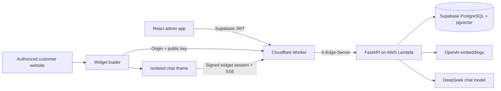

# Plug & Play

Plug & Play is a customer support assistant that answers from a company's own
documents and can be embedded on an authorized website with a script tag.

The application combines a React administration workspace, multilingual streaming
chat, document ingestion, retrieval-augmented generation, an isolated iframe widget,
a static marketing site, and a serverless deployment architecture.

## Product

### Multilingual, grounded support

The assistant retrieves relevant passages from the user's knowledge base and streams
a contextual response. Conversations are retained for follow-up questions, review,
ratings, and analytics.


### Document knowledge base

Administrators can upload PDF, DOC, DOCX, TXT, XLS, and XLSX files, inspect the number
of generated chunks, temporarily disable documents, and remove outdated material.


### Secure website installation

Each authenticated user owns one assistant profile and one website installation. The
settings workspace controls the exact authorized origin, installation status, public
key rotation, custom assistant behavior, and monthly usage.


## Highlights

- **Retrieval-augmented generation:** OpenAI `text-embedding-3-large` embeddings (1536 dims),
  PostgreSQL with pgvector, cosine search, and an HNSW index.
- **Multilingual streaming chat:** DeepSeek's OpenAI-compatible API streams grounded
  answers over SSE.
- **Document pipeline:** extraction, normalization, junk-fragment filtering,
  overlapping chunking, embedding, and re-ingestion without re-uploading files.
- **Embeddable widget:** a small dependency-free loader, Shadow DOM launcher, and
  isolated iframe chat application.
- **Per-user isolation:** Supabase JWT subjects map to separate assistant profiles,
  documents, conversations, analytics, and widget installations.
- **Public endpoint protection:** exact-origin widget bootstrap, short-lived signed
  sessions, key rotation, installation disablement, message-size validation, and
  atomic monthly quotas.
- **Edge controls:** Cloudflare rate limits public chat by client IP and installation,
  while a shared edge secret blocks direct access to the Lambda origin.
- **Operational visibility:** conversation history, customer ratings, unanswered
  question reporting, and retrieved-source debugging.

## Architecture



### Request security

1. The widget loader runs on the customer website and exchanges its public key from
   the configured browser origin.
2. The backend compares that exact origin with the user's active installation and
   returns a short-lived signed widget session.
3. The iframe uses the signed session for chat; it never uses a profile ID or public
   key as authorization.
4. Conversation IDs are accepted only when they belong to the session's profile.
   Missing, stale, or foreign IDs start a new conversation.
5. PostgreSQL atomically enforces the monthly installation quota before model work.

## Technology

| Area           | Stack                                                          |
| -------------- | -------------------------------------------------------------- |
| Frontend       | React 18, TypeScript, Vite, Tailwind CSS, SWR                  |
| Marketing site | Astro static SSG, Tailwind CSS, JSON-LD schema, per-page SEO   |
| Widget         | TypeScript, Shadow DOM, iframe isolation, Server-Sent Events   |
| Backend        | FastAPI, SQLAlchemy 2.0 async, Pydantic, Alembic               |
| Retrieval      | OpenAI embeddings, PostgreSQL, pgvector, HNSW cosine index     |
| Generation     | DeepSeek OpenAI-compatible streaming API                       |
| Authentication | Supabase Auth with JWT validation                              |
| Production     | AWS Lambda, ECR, Cloudflare Worker, Cloudflare Pages, Supabase |
| Testing        | pytest, Vitest, Testing Library, TypeScript production builds  |

## Run Locally

### Requirements

- Docker
- Node.js 18+
- A DeepSeek API key
- An OpenAI API key

### Backend

```bash
cd backend
cp .env.example .env
```

Set at least:

```env
DEEPSEEK_API_KEY=your-deepseek-key
OPENAI_API_KEY=your-openai-key
WIDGET_SESSION_SECRET=generate-a-long-random-secret
```

Start PostgreSQL and the API, then apply the schema:

```bash
docker compose up -d --build
docker compose run --rm backend alembic upgrade head
```

The API is available at `http://localhost:8000`; `GET /health` is the health check.
Authentication is optional in local development and required when the Supabase JWT
secret is configured.

### Frontend

```bash
cd frontend
cp .env.example .env
npm install
npm run dev
```

Open `http://localhost:5173`, upload documents under **Knowledge base**, then start a
conversation. To test the embedded widget, configure its exact website origin under
**Settings** and use the generated snippet.

### Marketing site

The public landing and legal pages are a separate static Astro project in `site/`:

```bash
cd site
npm install
npm run dev
```

Open `http://localhost:4321`. See [site/README.md](site/README.md) for details.

## Widget Build

```bash
cd frontend
npm run build:widget
```

The build creates:

```text
frontend/dist-widget/
|-- widget.js
`-- app/
    |-- index.html
    `-- assets/
```

Host that directory on a stable HTTPS origin and set `VITE_WIDGET_SRC` when building
the admin frontend so its generated installation snippet points to the deployed
loader.

## Tests

```bash
cd backend
pytest

cd ../frontend
npm test
npm run build
npm run build:widget
```

The backend suite covers authentication rejection, edge-secret enforcement, profile
isolation, foreign conversation IDs, message limits, signed widget sessions, and the
absence of retired voice endpoints. Frontend tests cover authentication and the main
application shell.

## Maintenance Scripts

- `backend/reingest_documents.py` rebuilds chunks and embeddings from each stored
  document after chunking, filtering, or embedding changes.
- `backend/reindex_embeddings.py` regenerates vectors for existing chunks without
  changing chunk boundaries.

## Deployment Notes

The production design uses Cloudflare Pages for the admin application and widget
assets, a Cloudflare Worker for edge authentication and rate limiting, an AWS Lambda
container with response streaming, and Supabase for authentication and pgvector data.

Production requires separate random values for `EDGE_SHARED_SECRET` and
`WIDGET_SESSION_SECRET`. The widget CDN must be present in `WIDGET_ALLOWED_ORIGINS`;
customer websites are authorized individually through each installation's exact
origin rather than a global wildcard.
