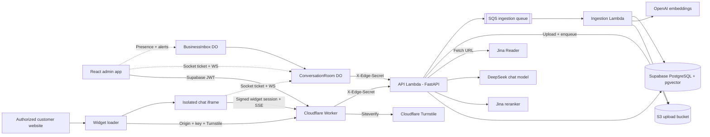

# Plug & Play

Plug & Play is a customer support assistant that answers from a company's own
documents and can be embedded on an authorized website with a script tag.

The application combines a React administration workspace, multilingual streaming
chat, asynchronous document and web-page ingestion, reranked retrieval-augmented
generation, live human handoff over WebSockets, an isolated iframe widget with
Cloudflare Turnstile bot protection, a static marketing site, and a two-Lambda
serverless deployment fronted by a Cloudflare Worker.

One authenticated owner can run **multiple websites** from a single workspace. Each
website has its own assistant, knowledge base, conversations, analytics, widget
installation, and monthly usage, fully isolated from the others.

## Product

### Multilingual, grounded support

The assistant retrieves relevant passages from the site's knowledge base and streams
a contextual response. Follow-up questions are rewritten into standalone retrieval
queries so context carries across a conversation. Conversations are retained for
review, ratings, and analytics.


### Document and link knowledge base

Administrators can upload PDF, DOC, DOCX, TXT, MD, XLS, and XLSX files, or add a web page
by URL, then watch each source move through its processing states (queued,
processing, ready, or failed) as a background Lambda extracts, chunks, and embeds it.
Pages are fetched and cleaned by Jina Reader and ingested through the same pipeline as
files. Admins can inspect the number of generated chunks, temporarily disable
sources, and remove outdated material.


### Multiple websites, one workspace

Each website is created with its own name, assistant, and authorized widget origin,
and is switched between from the sidebar. Per-site settings control the exact
authorized origin, installation status, public key rotation, custom assistant
behavior, monthly usage, and whether live human handoff is available.


## Features

- **Hybrid, reranked retrieval-augmented generation:**
- **Multilingual streaming chat:**
- **Asynchronous ingestion pipeline:**
- **Live human handoff:**
- **Multi-site workspace:**
- **Embeddable widget:**
- **Bot protection:**
- **Public endpoint protection:**
- **Edge controls:**
- **Operational visibility:**

## Architecture



### Request security

1. The widget loader runs on the customer website and exchanges its public key, plus
   a Cloudflare Turnstile token, from the configured browser origin.
2. The edge Worker verifies the Turnstile token with Siteverify (matching the expected
   hostname and action) and, on success, injects an internal attestation header. The
   backend trusts only that header - never the raw token - when Turnstile enforcement
   is enabled.
3. The backend compares that exact origin with the site's active installation and
   returns a short-lived signed widget session.
4. The iframe uses the signed session for chat; it never uses a profile ID or public
   key as authorization.
5. Conversation IDs are accepted only when they belong to the session's site.
   Missing, stale, or foreign IDs start a new conversation.
6. PostgreSQL atomically enforces the monthly installation quota before model work.

### Retrieval-augmented generation

Retrieval runs up front on every turn (RAG-always) and the answer streams in a single
model call:

1. A follow-up message is rewritten into a standalone retrieval query using bounded
   recent history; the literal message is searched too, and any rewrite failure falls
   back to it.
2. Each query variant runs both semantic search (pgvector cosine over the HNSW index,
   dropping results below the relevance threshold) and lexical full-text search. The
   ranked lists are fused with Reciprocal Rank Fusion into one candidate set.
3. A Jina cross-encoder reranks the fused candidates against the standalone question
   and keeps the best `RAG_TOP_K`. Reranking and contextualization are best-effort -
   without a key, or on any error or timeout, fusion order (and the literal query) is
   used, so a search never blocks an answer.
4. The top chunks are injected as a system message and DeepSeek V4-Flash streams the
   grounded answer over SSE, emitting structured `conversation`/`sources`/`token`/
   `done` events.

## Technology

| Area           | Stack                                                             |
| -------------- | ----------------------------------------------------------------- |
| Frontend       | React 18, TypeScript, Vite, Tailwind CSS, SWR, React Router       |
| Marketing site | Astro static SSG, Tailwind CSS, JSON-LD schema, per-page SEO      |
| Widget         | TypeScript, Shadow DOM, iframe isolation, Server-Sent Events      |
| Backend        | FastAPI, SQLAlchemy 2.0 async, Pydantic, Alembic                  |
| Ingestion      | SQS-triggered Lambda, S3, antiword, Jina Reader (URL fetch)       |
| Retrieval      | OpenAI embeddings, PostgreSQL, pgvector HNSW, Jina reranker       |
| Generation     | DeepSeek V4-Flash (OpenAI-compatible streaming API)               |
| Live support   | Cloudflare Durable Objects, WebSocket Hibernation, callback queue |
| Bot protection | Cloudflare Turnstile (edge Siteverify + backend attestation)      |
| Authentication | Supabase Auth with JWT validation                                 |
| Production     | Two AWS Lambdas, ECR, S3, SQS, Cloudflare Worker/Pages, Supabase  |
| Testing        | pytest, Vitest, Testing Library, TypeScript production builds     |

## Run Locally

### Requirements

- Docker
- Node.js 18+
- A DeepSeek API key
- An OpenAI API key
- A Jina API key (optional - enables reranking and URL ingestion)

### Backend

```bash
cd backend
cp .env.example .env
```

Set at least:

```env
DEEPSEEK_API_KEY=your-deepseek-key
OPENAI_API_KEY=your-openai-key
WIDGET_SESSION_SECRET=generate-a-long-random-secret
```

Optionally set `JINA_API_KEY` to enable retrieval reranking and web-page ingestion;
without it, retrieval falls back to cosine order and URL ingestion is unavailable.

Start PostgreSQL and the API, then apply the schema:

```bash
docker compose up -d --build
docker compose run --rm backend alembic upgrade head
```

### Frontend

```bash
cd frontend
cp .env.example .env
npm install
npm run dev
```

Open `http://localhost:5173`, create your first website, upload documents or add a URL
under **Knowledge base**, then start a conversation. To test the embedded widget,
configure the site's exact website origin under **Settings** and use the generated
snippet.

### Marketing site

The public landing and legal pages are a separate static Astro project in `site/`:

```bash
cd site
npm install
npm run dev
```

Open `http://localhost:4321`. See [site/README.md](site/README.md) for details.

## Widget Build

```bash
cd frontend
npm run build:widget
```

The build creates:

```text
frontend/dist-widget/
|-- widget.js
`-- app/
    |-- index.html
    `-- assets/
```

Host that directory on a stable HTTPS origin and set `VITE_WIDGET_SRC` when building
the admin frontend so its generated installation snippet points to the deployed
loader.

## Tests

```bash
cd backend
pytest

cd ../frontend
npm test
npm run build
npm run build:widget

cd ../deploy/cloudflare/worker
npm ci
npm run check
npm test
```

## Maintenance Scripts

- `backend/reingest_documents.py` rebuilds chunks and embeddings from each stored
  document after chunking, filtering, or embedding changes.
- `backend/reindex_embeddings.py` regenerates vectors for existing chunks without
  changing chunk boundaries.

  </content>
