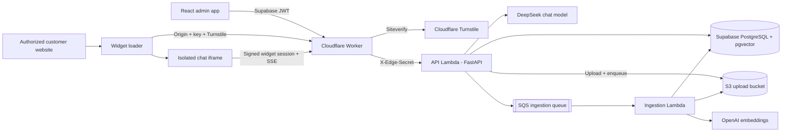

# Plug & Play

Plug & Play is a customer support assistant that answers from a company's own
documents and can be embedded on an authorized website with a script tag.

The application combines a React administration workspace, multilingual streaming
chat, asynchronous document ingestion, retrieval-augmented generation, an isolated
iframe widget with Cloudflare Turnstile bot protection, a static marketing site, and
a two-Lambda serverless deployment architecture.

## Product

### Multilingual, grounded support

The assistant retrieves relevant passages from the user's knowledge base and streams
a contextual response. Conversations are retained for follow-up questions, review,
ratings, and analytics.


### Document knowledge base

Administrators can upload PDF, DOC, DOCX, TXT, XLS, and XLSX files, then watch each
one move through its processing states (queued, processing, ready, or failed) as a
background Lambda extracts, chunks, and embeds it. They can inspect the number of
generated chunks, temporarily disable documents, and remove outdated material.


### Secure website installation

Each authenticated user owns one assistant profile and one website installation. The
settings workspace controls the exact authorized origin, installation status, public
key rotation, custom assistant behavior, and monthly usage.


## Highlights

- **Retrieval-augmented generation:** OpenAI `text-embedding-3-large` embeddings (1536 dims),
  PostgreSQL with pgvector, cosine search, and an HNSW index.
- **Multilingual streaming chat:** DeepSeek's OpenAI-compatible API streams grounded
  answers over SSE.
- **Asynchronous document pipeline:** uploads are stored in S3 and queued to a
  dedicated ingestion Lambda that extracts, normalizes, filters junk fragments,
  chunks with overlap, and embeds - off the request path, with a dead-letter queue
  for failures and re-ingestion without re-uploading files.
- **Embeddable widget:** a small dependency-free loader, Shadow DOM launcher, and
  isolated iframe chat application.
- **Bot protection:** Cloudflare Turnstile guards the widget session bootstrap. The
  edge Worker verifies the token (checking hostname and action) before the backend
  will issue a session, and the backend trusts only the Worker's attestation header -
  never the raw token.
- **Per-user isolation:** Supabase JWT subjects map to separate assistant profiles,
  documents, conversations, analytics, and widget installations.
- **Public endpoint protection:** exact-origin widget bootstrap, short-lived signed
  sessions, key rotation, installation disablement, message-size validation, and
  atomic monthly quotas.
- **Edge controls:** Cloudflare rate limits public chat by client IP and installation
  and throttles widget-session attempts, while a shared edge secret blocks direct
  access to the Lambda origin.
- **Operational visibility:** conversation history, customer ratings, unanswered
  question reporting, and retrieved-source debugging.

## Architecture



### Request security

1. The widget loader runs on the customer website and exchanges its public key, plus
   a Cloudflare Turnstile token, from the configured browser origin.
2. The edge Worker verifies the Turnstile token with Siteverify (matching the expected
   hostname and action) and, on success, injects an internal attestation header. The
   backend trusts only that header - never the raw token - when Turnstile enforcement
   is enabled.
3. The backend compares that exact origin with the user's active installation and
   returns a short-lived signed widget session.
4. The iframe uses the signed session for chat; it never uses a profile ID or public
   key as authorization.
5. Conversation IDs are accepted only when they belong to the session's profile.
   Missing, stale, or foreign IDs start a new conversation.
6. PostgreSQL atomically enforces the monthly installation quota before model work.

### Asynchronous document ingestion

Ingestion runs off the request path across the two Lambdas:

1. An admin upload is validated (type and 10 MB limit), stored encrypted in the S3
   upload bucket, recorded as a `queued` document, and enqueued to SQS. The API
   responds `202 Accepted` immediately.
2. The SQS-triggered ingestion Lambda downloads the object, marks the document
   `processing`, then extracts, chunks, and embeds it (the `.doc` path uses the
   `antiword` binary baked into the ingestion image).
3. On success the document flips to `ready` and its source object is deleted; on an
   unsupported file or extraction error it is marked `failed`. Transient errors retry
   up to three times before the message lands in the dead-letter queue.

## Technology

| Area           | Stack                                                            |
| -------------- | ---------------------------------------------------------------- |
| Frontend       | React 18, TypeScript, Vite, Tailwind CSS, SWR                    |
| Marketing site | Astro static SSG, Tailwind CSS, JSON-LD schema, per-page SEO     |
| Widget         | TypeScript, Shadow DOM, iframe isolation, Server-Sent Events     |
| Backend        | FastAPI, SQLAlchemy 2.0 async, Pydantic, Alembic                 |
| Ingestion      | SQS-triggered Lambda, S3, antiword, async S3/SQS transport       |
| Retrieval      | OpenAI embeddings, PostgreSQL, pgvector, HNSW cosine index       |
| Generation     | DeepSeek OpenAI-compatible streaming API                         |
| Bot protection | Cloudflare Turnstile (edge Siteverify + backend attestation)     |
| Authentication | Supabase Auth with JWT validation                                |
| Production     | Two AWS Lambdas, ECR, S3, SQS, Cloudflare Worker/Pages, Supabase |
| Testing        | pytest, Vitest, Testing Library, TypeScript production builds    |

## Run Locally

### Requirements

- Docker
- Node.js 18+
- A DeepSeek API key
- An OpenAI API key

### Backend

```bash
cd backend
cp .env.example .env
```

Set at least:

```env
DEEPSEEK_API_KEY=your-deepseek-key
OPENAI_API_KEY=your-openai-key
WIDGET_SESSION_SECRET=generate-a-long-random-secret
```

Start PostgreSQL and the API, then apply the schema:

```bash
docker compose up -d --build
docker compose run --rm backend alembic upgrade head
```

The API is available at `http://localhost:8000`; `GET /health` is the health check.
Authentication is optional in local development and required when the Supabase JWT
secret is configured.

Document ingestion runs on AWS: uploads are stored in S3 and processed by a separate
SQS-triggered Lambda. To exercise uploads locally, set `INGESTION_BUCKET`,
`INGESTION_QUEUE_URL`, and `AWS_REGION` (pointing at real or emulated S3/SQS) and run
the ingestion handler against the queue; without them the upload endpoint returns
`503`.

### Frontend

```bash
cd frontend
cp .env.example .env
npm install
npm run dev
```

Open `http://localhost:5173`, upload documents under **Knowledge base**, then start a
conversation. To test the embedded widget, configure its exact website origin under
**Settings** and use the generated snippet.

### Marketing site

The public landing and legal pages are a separate static Astro project in `site/`:

```bash
cd site
npm install
npm run dev
```

Open `http://localhost:4321`. See [site/README.md](site/README.md) for details.

## Widget Build

```bash
cd frontend
npm run build:widget
```

The build creates:

```text
frontend/dist-widget/
|-- widget.js
`-- app/
    |-- index.html
    `-- assets/
```

Host that directory on a stable HTTPS origin and set `VITE_WIDGET_SRC` when building
the admin frontend so its generated installation snippet points to the deployed
loader.

## Tests

```bash
cd backend
pytest

cd ../frontend
npm test
npm run build
npm run build:widget
```

The backend suite covers authentication rejection, edge-secret enforcement, Turnstile
attestation on the widget bootstrap, profile isolation, foreign conversation IDs,
message limits, signed widget sessions, chat guardrails, asynchronous ingestion
queueing and status transitions, secret redaction, and the absence of retired voice
endpoints. Frontend tests cover authentication and the main application shell.

## Maintenance Scripts

- `backend/reingest_documents.py` rebuilds chunks and embeddings from each stored
  document after chunking, filtering, or embedding changes.
- `backend/reindex_embeddings.py` regenerates vectors for existing chunks without
  changing chunk boundaries.

## Deployment Notes

The production design uses Cloudflare Pages for the admin application and widget
assets, a Cloudflare Worker for edge authentication, Turnstile verification, and rate
limiting, and Supabase for authentication and pgvector data. The backend runs as two
AWS Lambda container images built from separate Dockerfiles:

- **API Lambda** (`Dockerfile.lambda`, `requirements-api.txt`) - FastAPI behind the
  Lambda Web Adapter with response streaming for SSE. Deployed by
  `deploy/aws/deploy-backend.sh`.
- **Ingestion Lambda** (`Dockerfile.ingestion.lambda`, `requirements-ingestion.txt`) -
  the SQS-triggered document processor, with `antiword` for legacy `.doc` files.
  Deployed by `deploy/aws/deploy-ingestion.sh`.

Production requires separate random values for `EDGE_SHARED_SECRET` and
`WIDGET_SESSION_SECRET`. The widget CDN must be present in `WIDGET_ALLOWED_ORIGINS`;
customer websites are authorized individually through each installation's exact
origin rather than a global wildcard. The API Lambda also needs `INGESTION_BUCKET`
and `INGESTION_QUEUE_URL` to accept uploads.

Turnstile enforcement is opt-in and staged: deploy the validating Worker first
(`TURNSTILE_SECRET_KEY`, `TURNSTILE_EXPECTED_HOSTNAME`, `TURNSTILE_EXPECTED_ACTION`),
then set `TURNSTILE_REQUIRED=true` on the backend so it rejects any widget session
that did not arrive with the Worker's verification header.
